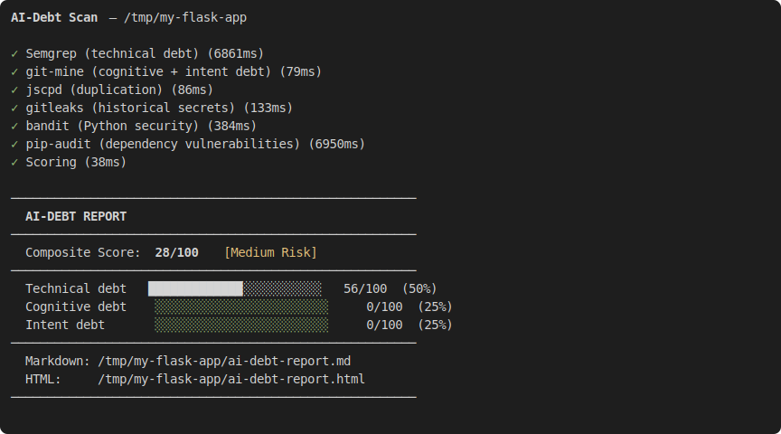
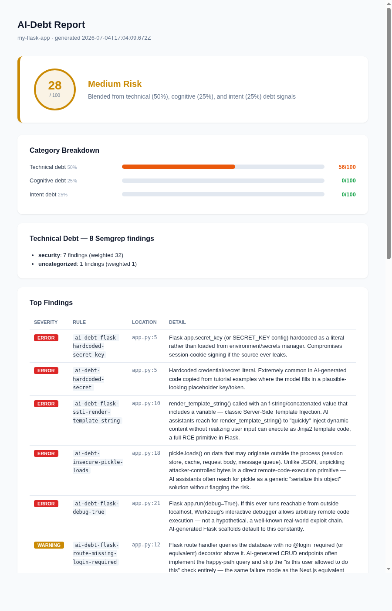

# ai-debt-audit

[](https://github.com/aniruddhavasudev/ai-debt-audit/actions/workflows/ci.yml)


**Measure comprehension debt in AI-generated code.**

A repo scanner for the specific mess that AI coding assistants leave behind: disabled RLS policies, auth checks that only exist in the happy path, `debug=True` still on, secrets copy-pasted from a tutorial, and the quieter stuff — one person owning half the codebase, commits that just say "fix," nobody writing down why anything is the way it is.

Point it at a repo, it runs six tools, you get one score and a full breakdown. Takes a few seconds. Fully local — nothing calls an LLM, nothing leaves your machine.



Real example: [`examples/sample-report.md`](examples/sample-report.md) — a scan of a real, public Next.js/Supabase SaaS starter, unedited. Nothing here is a mockup.



If you run this and it finds something real, a star helps other people find it too 👇

## Why this exists

By some counts, roughly 10,000 startups shipped a production app built mostly by an AI assistant in the last year or so. More than 8,000 of them are now looking at a partial rebuild. That gap — between "it works" and "it's fine to build on" — is what this tries to measure before it becomes a $50k+ surprise.

I built it deterministic on purpose. Every finding traces back to a specific rule and a specific line — no "the model thinks this looks risky," because that's not something you can hand to a VC doing diligence or argue with when it's wrong. (And it is sometimes wrong — see the note below about the auth-check rule.) Nothing in this pipeline calls out to an LLM. Nothing leaves your machine.

## The six tools, and what each one actually catches

| Tool | What it's for |
|---|---|
| Semgrep, 44 custom rules | The AI-specific stuff: disabled Supabase RLS, Flask SSTI via `render_template_string`, Django `DEBUG=True`, swallowed exceptions, `NotImplementedError` stubs that made it to main |
| Semgrep's own `p/django` + `p/flask` packs | Didn't want to hand-write every Django/Flask rule when Semgrep's community registry already covers XSS and mass-assignment better than I would |
| Bandit | Python security linting — hardcoded passwords, `pickle.loads`, that kind of thing |
| pip-audit | Checks your actual pinned dependency versions against known CVEs |
| jscpd | Copy-paste detection |
| gitleaks | Secrets anywhere in git history, not just the current snapshot — a key that was committed and deleted three months ago still counts |

Plus a small custom script (`scripts/git-mine.js`) that mines git log for the stuff none of the above can see: bus factor, generic commit messages, whether refactoring is actually happening or just piling up.

## Getting it running

You'll need these installed first:
```bash
pip install semgrep bandit pip-audit
```
and gitleaks — [instructions here](https://github.com/gitleaks/gitleaks#installing), it's a single binary, no package manager needed.

Then:
```bash
git clone https://github.com/aniruddhavasudev/ai-debt-audit.git
cd ai-debt-audit
npm install
npm link
```

That last command makes `aidebt-scan` available anywhere on your machine. Try it on something:
```bash
aidebt-scan /path/to/any/repo
```

## What comes out

```
AI-Debt Scan — /path/to/repo

✓ Semgrep (technical debt) (3500ms)
✓ git-mine (cognitive + intent debt) (34ms)
✓ jscpd (duplication) (46ms)
✓ gitleaks (historical secrets) (141ms)
✓ bandit (Python security) (140ms)
✓ Scoring (26ms)

────────────────────────────────────────────────────────
  AI-DEBT REPORT
────────────────────────────────────────────────────────
  Composite Score: 28/100   [Medium Risk]
────────────────────────────────────────────────────────
  Technical debt   ███░░░░░░░░░░░░░░░░░░░░░   14/100  (50%)
  Cognitive debt   ███████████████████░░░░░   81/100  (25%)
  Intent debt      █░░░░░░░░░░░░░░░░░░░░░░░    3/100  (25%)
────────────────────────────────────────────────────────
  Markdown: ai-debt-report.md
  HTML:     ai-debt-report.html
────────────────────────────────────────────────────────
```

That's a real run, not a mockup. You get a Markdown report with every finding and a styled standalone HTML version, side by side, every time.

## Flags

```bash
aidebt-scan <path-to-repo> [--out report.md] [--html report.html] [--json scores.json]
                           [--sarif results.sarif] [--fail-on-score N] [--pdf report.pdf]
```

`--out` picks where the Markdown goes (`./ai-debt-report.md` if you don't say). `--html` does the same for the HTML version — pass `--html ""` if you don't want one. `--json` dumps the raw numbers, useful if you want to track a score over time instead of just reading one report. `--sarif` writes GitHub's native code-scanning format (see the GitHub Action below). `--fail-on-score N` exits non-zero if the composite score is `>= N` — the hook a CI pipeline needs to actually block something, not just print a number. `--pdf` renders the HTML report to an actual PDF via headless Chrome/Chromium (whichever is on `PATH`) — the format you'd actually hand someone as a deliverable.

## Customizing the score with `.aidebtrc.json`

Drop this at the root of the repo being scanned to override the defaults:

```json
{
  "weights": { "technical": 0.6, "cognitive": 0.2, "intent": 0.2 },
  "ignoreRules": ["ai-debt-console-log-debug-leftover"],
  "excludePaths": ["vendor/**", "*/migrations/*"]
}
```

All three keys are optional. `weights` overrides the 50/25/25 default split (they don't need to sum to 1 — the composite is just a weighted average). `ignoreRules` drops specific rule IDs from scoring entirely, not just from the report. `excludePaths` does the same for whole paths, using simple glob patterns (`*` and `**`).

## Using it as a GitHub Action

```yaml
- uses: aniruddhavasudev/ai-debt-audit@main
  with:
    path: .
    fail-on-score: '70'   # optional — omit to report without blocking the PR
```

This runs the full scan on every PR, uploads findings to GitHub's Security tab as SARIF, and attaches the Markdown/HTML reports as workflow artifacts. See [`action.yml`](action.yml) for all inputs.

## About that `test-fixtures/` folder

It's full of fake credentials — a placeholder API key, AWS's own example access key, a Django `django-insecure-` dev key, a Flask secret that's just the word "secret" with numbers on it. That's on purpose, it's how I verified every rule actually fires instead of just parsing cleanly. If GitHub's secret scanner ever flags one of these, that's why — none of them are real.

## Where this actually stands

Honest version: the scoring weights (why technical debt counts for 50% and not 40%, why 20% duplication maxes out the duplication score) are a first pass, not something derived from a pile of calibration data yet. I tested it against a handful of real repos while building it and found real bugs this way — the "missing auth check" rule used to false-positive on any app using centralized middleware for auth, which is most of them, until I added a check for that. There's probably more like it I haven't found yet.

If you run this against your own repo and a finding looks wrong, that's more useful to me right now than a star.
