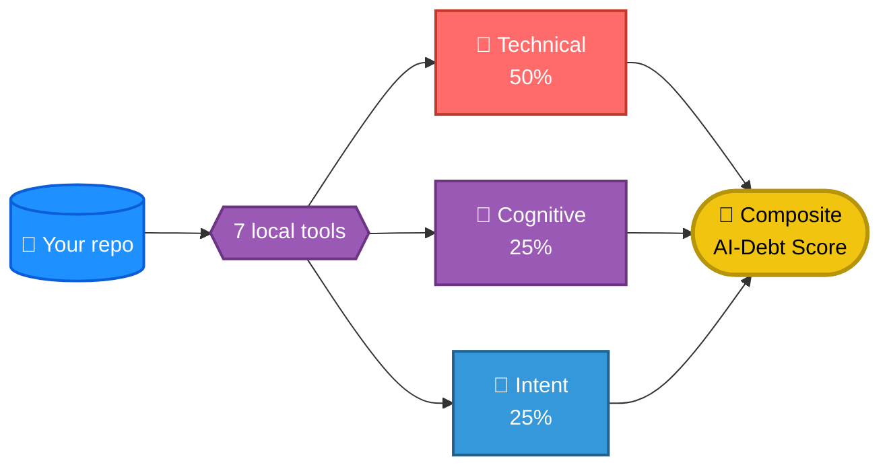

<div align="center">
  

  # ai-debt-audit

  **Measure comprehension debt in AI-generated code.**

  [](https://github.com/aniruddhavasudev/ai-debt-audit/actions/workflows/ci.yml)
  [](examples/sample-report.md)
  
  
  
  
  [](LICENSE)
  [](https://github.com/aniruddhavasudev/ai-debt-audit/stargazers)

  *The "AI-Debt Score" badge above is this repo scanning itself, on a schedule — a live number, not a claim.*

  <p>
    <a href="#quick-start"><b>Quick Start</b></a> ·
    <a href="docs/TOOLS.md"><b>The Seven Tools</b></a> ·
    <a href="docs/USAGE.md"><b>Full Usage Guide</b></a> ·
    <a href="CALIBRATION.md"><b>Calibration Notes</b></a> ·
    <a href="CONTRIBUTING.md"><b>Contributing</b></a>
  </p>
</div>

---

A repo scanner for the mess AI coding assistants leave behind: disabled RLS, auth checks that only exist in the happy path, `debug=True` left on, tutorial-pasted secrets — plus the quieter stuff, one person owning half the codebase, commits that just say "fix."

Point it at a repo, it runs seven deterministic tools, you get one score and a full breakdown in seconds. **Fully local — nothing calls an LLM, nothing leaves your machine.**

<table>
<tr>
<td width="33%" valign="top">

### 🔧 Technical debt


Security holes, duplicated logic, unfinished stubs — 74 custom Semgrep rules + Bandit, pip-audit, npm audit, jscpd.

</td>
<td width="33%" valign="top">

### 🧠 Cognitive debt


Knowledge concentration — what happens if the one person who understands this leaves. Measured from real git history.

</td>
<td width="33%" valign="top">

### 📝 Intent debt


Whether anyone wrote down *why*. Proxied from commit quality and refactor cadence.

</td>
</tr>
</table>

**Risk tiers**, same 0-100 scale every time:
   




**Real example:** [`examples/sample-report.md`](examples/sample-report.md) — a scan of a real, public Next.js/Supabase SaaS starter, unedited.


If you run this and it finds something real, a star helps other people find it too 👇

## Quick start

```bash
# Docker — zero local installs
docker build -t ai-debt-audit .
docker run --rm -v /path/to/any/repo:/repo ai-debt-audit . --out ai-debt-report.md
```

```bash
# Local install
pip install semgrep bandit pip-audit   # + gitleaks: https://github.com/gitleaks/gitleaks#installing
git clone https://github.com/aniruddhavasudev/ai-debt-audit.git
cd ai-debt-audit && npm install && npm link
aidebt-scan /path/to/any/repo
```

```
────────────────────────────────────────────────────────
  AI-DEBT REPORT
────────────────────────────────────────────────────────
  Composite Score: 28/100   [Medium Risk]
────────────────────────────────────────────────────────
  Technical debt   ███░░░░░░░░░░░░░░░░░░░░░   14/100  (50%)
  Cognitive debt   ███████████████████░░░░░   81/100  (25%)
  Intent debt      █░░░░░░░░░░░░░░░░░░░░░░░    3/100  (25%)
────────────────────────────────────────────────────────
```
A real run, not a mockup — Markdown + styled standalone HTML, every time.

**→ Full flag reference, `.aidebtrc.json` config, GitHub Action setup, and Claude Code skill install: [docs/USAGE.md](docs/USAGE.md)**

**→ What each of the seven tools catches and how the score is composed: [docs/TOOLS.md](docs/TOOLS.md)**

## License

[AGPL-3.0](LICENSE) — use, modify, and self-host freely, including commercially. If you run a modified version as a network service, you must share your modified source with its users. Deliberate: it stops a silent closed-source fork of a hosted competitor.

## Where this stands

Scoring weights are a v1 heuristic, not yet calibrated against a large repo sample — see [CALIBRATION.md](CALIBRATION.md) for real findings so far. If a finding looks wrong against your own repo, that's more useful to report than a star.
